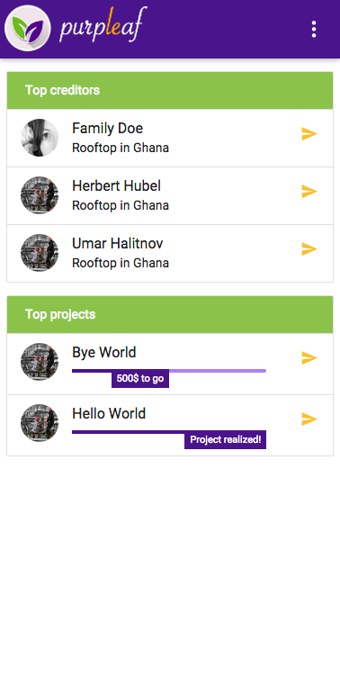

# PurpLeaf

## Elevator pitch

> In three sentences – what’s your idea?

## Screenshot

  

## Type of the project

* web app

## MVP

> What’s the minimum viable product? Which features does it have?

## Target group

> Who should use your product?

## Use Case

> How will users typically use this product?

## Challenges & solutions

> What was the most difficult part of the project? What problems did you encounter? How did you solve them?

## Scalability

> How can the project be further developed?

## Technology

> Which frameworks and solutions did you use?

## Link

> Please insert the deployment link. This is crucial. Try not to host things just locally.

## Source code

* [https://github.com/poctec/purpleleaf](https://github.com/poctec/purpleleaf)

## Team

* Daniela Hamacher (design), daniela.hamacher@finanzen100.de
* Falk Lange (concept), falk.lange@finanzen100.de
* Patrick Gollmer (frontend), patrick.gollmer@finanzen100.de
* Pierre Beaucamp (backend), mail@pierrebeaucamp.com
